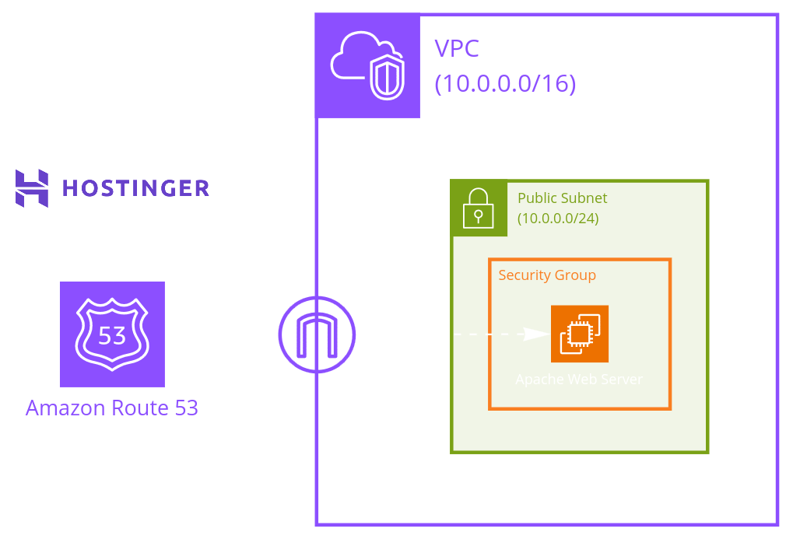
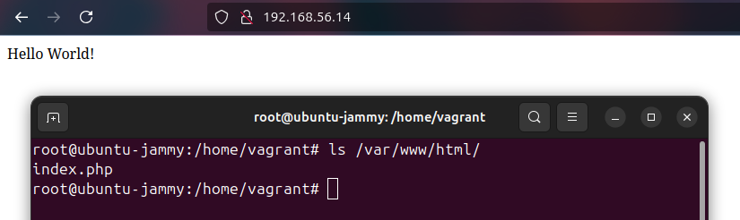
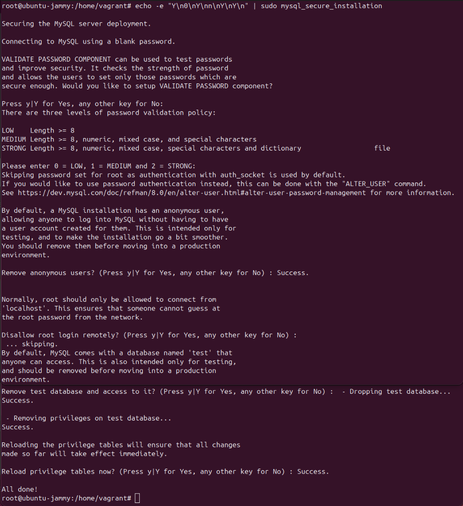
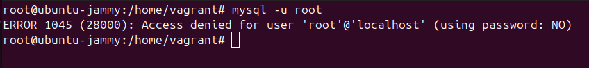
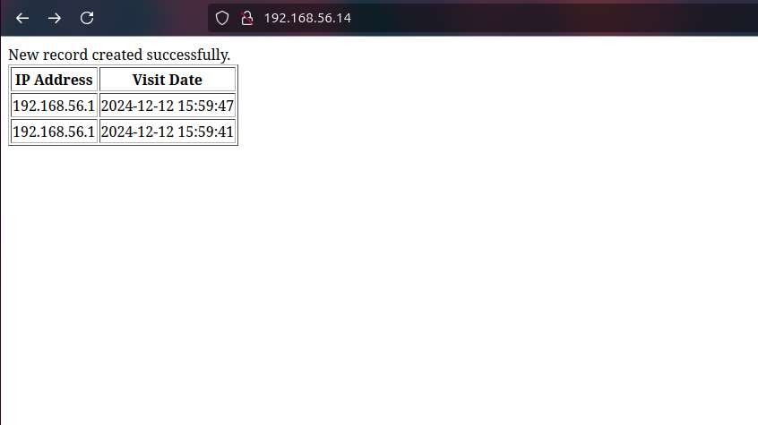
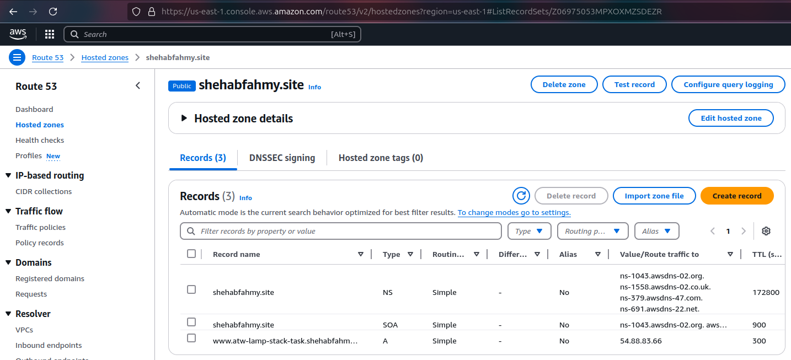
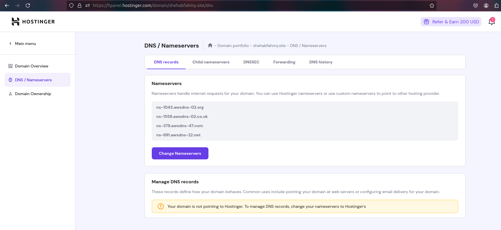

# Task: Set up a Web Server on a Linux Machine
## Overview
Set up a basic LAMP (Linux, Apache, MySQL, PHP) stack on a Linux server, host a simple PHP-based webpage, integrate database functionality, and make it accessible externally via a public URL. Then use Git to manage the code and documentation, push it to GitHub, and write clear explanations of fundamental networking concepts.


---

## Sub-task #1: Linux Server Simulation (LAMP Setup)
### 0) Vagrant Configuration
We will deploy the website locally on an Ubuntu virtual machine using *Oracle VM Virtualbox* and *Vagrant*.
- In the Vagrantfile directory, run:
```sh
vagrant up
vagrant ssh
```
- Switch to `root` user:
```sh
sudo su
```
### 1) Required Packages Installation
- Install `Apache`, `MySQL`, `PHP`, `PHP and Apache communication module`, and `PHP and MySQL communication module`:
```sh
sudo apt-get update
sudo apt-get install apache2 mysql-server php libapache2-mod-php php-mysql -y
```
### 2) Apache Configuration
- Ensure that the server is configured to serve the website from the `/var/www/html/` directory by creating a simple `index.html` with `Hello World!` sentence:
```sh
sudo rm /var/www/html/index.html
echo "Hello World!" > index.html
sudo mv index.html /var/www/html/
```
- Ensure it is accessible via `http://<server-ip>/`:
***Note:*** Get the private IP specified in the Vagrantfile or by running the `hostname -I` command then use it in your host (main) machine's web browser. It will access port 80 by default.

### 3) Simple Website Creation
- Replace `index.html` with `index.php` that displays `Hello World!`:
```sh
echo '<?php echo "Hello World!"; ?>' > /var/www/html/index.html
sudo mv /var/www/html/index.html /var/www/html/index.php
```
- Verify this by accessing `http://<server-ip>/` in a web browser:

### 4) MySQL Configuration
- Secure the MySQL installation by running `mysql_secure_installation` script:
```sh
echo -e "Y\n0\nY\nn\nY\nY\n" | sudo mysql_secure_installation
```

- Set root password, if not asked to while running the script:
```sh
DB_PASSWORD=$(cat /vagrant/Secrets/DB_PASSWORD.txt)
sudo mysql -e " \
ALTER USER 'root'@'localhost' IDENTIFIED WITH mysql_native_password BY '$DB_PASSWORD'; \
FLUSH PRIVILEGES;"
```
Check by accessing the database as root user without the password, it should deny your access:

- Create a new database `web_db` and a new MySQL user `web_user` with a password:
```sh
DB_USER_PASSWORD=$(cat /vagrant/Secrets/DB_USER_PASSWORD.txt)
mysql -u root -p$DB_PASSWORD -e " \
CREATE DATABASE web_db; \
CREATE USER 'web_user'@'localhost' IDENTIFIED BY '$DB_USER_PASSWORD'; \
GRANT ALL PRIVILEGES ON web_db.* TO 'web_user'@'localhost'; \
FLUSH PRIVILEGES;"
```
- Load database schema, which is a `visitors` table to store visitor's IP address and time of visit:
```sh
mysql -u root -p$DB_PASSWORD web_db < /vagrant/db_schema.sql
```
### 5) Website Modification to Use the Database:
- Update the `index.php` to connect to MySQL, fetch the visitor's IP address and the current time, and store them in the database:
***Note:*** The `index.php` is located in the `Vagrant` directory, so it can be synced with the virtual machine.
- Replace the old `index.php` with the new one in `/vagrant`:
```sh
cp /vagrant/index.php /var/www/html/
```
***Note:*** You can check the error logs through `sudo tail -f /var/log/apache2/error.log`
#### Firewall Configuration
This is an *optional* step (unnecessary for `localhost` setup) but *essential for remote access*, to secure the server properly by limiting access to trusted IPs using additional firewall rules.
```sh
systemctl start firewalld
systemctl enable firewalld
firewall-cmd --get-active-zones
firewall-cmd --zone=public --add-port=3306/tcp --permanent
firewall-cmd --reload
systemctl restart mysql
```
### 6) Testing Locally
- Access the website again and verify that it now shows the visitor’s IP address and the current time:

### 7) AWS Cloud Deployment
After confirming that everything is working well, we will deploy our website on AWS cloud to make it publicly accessible, using Terraform for infrastructure provisioning.
#### Terraform Configuration
- `Providers.tf`:
```HCL
provider "aws" {
  profile = "default"
  region  = "us-east-1"
}
```
- Initialize Terraform Project:
```sh
terraform init
# Ensure resources definitions are correct before applying
terraform plan
# Apply resources
terraform apply -auto-approve
```
#### VPC, Subnet, and Security Group Configuration
- VPC cidr_block: `10.0.0.0/16`
- Public Subnet cidr_block: `10.0.0.0/24`
- Internet Gateway for the subnet to access the internet.
- Route Table with a rule to forward traffic to the internet gateway.
- Dynamic Key-pair Creation: It gets created with the resources creation and destroyed with their destruction.
- Security Group: For Ingress (Inbound) and Egress (Outbound) rules specification.
    - Ingress rules:
        - Allow HTTP traffic on port 80 from anywhere.
        - Allow SSH access on port 22 from my public IP only (for remote execution provisioner and troubleshooting).
    - Egress rule:
        - Allows all outbound traffic (any protocol, any port) to any destination on the internet.
#### Public IP Allocation
- Ensure the instance gets a public IP by making this boolean EC2 resource parameter equals `true`:
  `associate_public_ip_address = var.is-public`
- Public IP Access:

#### Domain Registration and DNS Configuration
1. Purchase a domain from `hostinger.com`.
2. Create a Route53 hosted zone with the same name of the domain.
3. Add a Route53 record of type `A`, for the `atw-lamp-stack-task` subdomain, pointing to the PHP web server's public IP.

4. Output the Route53 zone's name servers through Terraform.
5. Add the name servers to the domain registrar.

#### Final Result


---

## Sub-task #2: Git & GitHub
- In the project directory, run:
```sh
git init
git add .
# You can use git commit to open vim and type a long and detailed commit
git commit -m "Initial Commit: Added Documentation, Local Setup Files (Vagrant), and AWS Deployment Files (Terraform)"
git branch -M main
git remote add origin git@github.com:ShehabFahmy/LAMP_Stack_Web_Hosting.git
git push -u origin main
```

---

## Sub-task #3: Networking Basics
### Explain:
1. IP Address: What it is and its purpose in networking.
-> The basic type of Network Layer Internet Protocol (IP) is IPv4 which is a 32-bit ID, divided into 4 octets, for each host and router making each one of them uniquely identified and easily reached (addressed) within a network to correctly send a packet from source to destination. The increasing number of devices connecting to the internet made a problem as we only have 2^32 IP addresses, so IPv6 had to come to the light to solve this problem with a bigger number of addresses as it consists of 128 bits.
2. MAC Address: What it is, its purpose, and how it differs from an IP address.
-> A 48-bit Data Link layer identifier, burned on Network Interface Card (NIC) making the host uniquely identified globally. It works as an identifier for hosts within the same local area network (LAN). IP addresses are used to route packets between different networks, working at the Network Layer while MAC addresses are used in LANs to correctly direct data to its destination.
3. Switches, Routers, and Routing Protocols: Basic definitions and their roles in a network.
-> Switches: Data Link Layer device that stores MAC addresses to forward data to the correct port or device corresponding to the MAC address in the MAC table record.
-> Routers: Network Layer device that stores IP addresses to route packets between networks efficiently using routing algorithms. Stores source IP addresses corresponding to destination IP addresses to forward the packets on.
-> Routing Protocols: Efficient routing algorithms of different calculations and methods to find the best route for a packet to hop from source to destination.
4. Remote Connection to Cloud Instance: Steps you would take to connect to your cloud-based Linux instance from a remote machine (e.g., using SSH).
- Allow traffic on port 22 for my IP (or from anywhere, but this isn't a good practice) in the security group.
- Make sure that the `openssh-client` package is installed on the local machine and `openssh-server` package is installed on the remote one.
- SSH is usually based on private and public keys exchange, so the public key is kept on the remote machine (SSH Server) while the private key is used for authentication on the local machine (SSH Client).
- Get the server's public IP.
- Change private key file's permission `chmod 400`.
- Use the `ssh` command to establish a connection with the key file, the user you want to login with, and the server's public IP.

---
